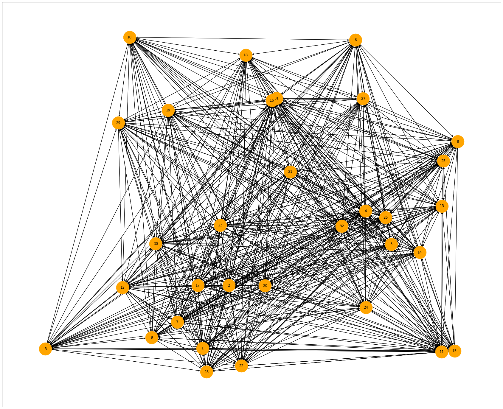
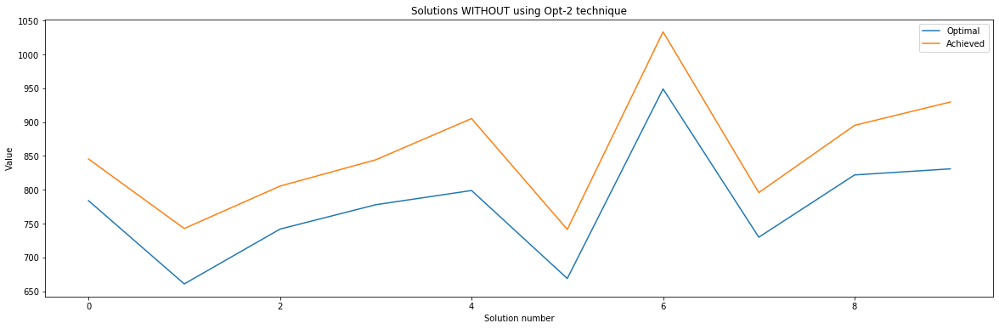
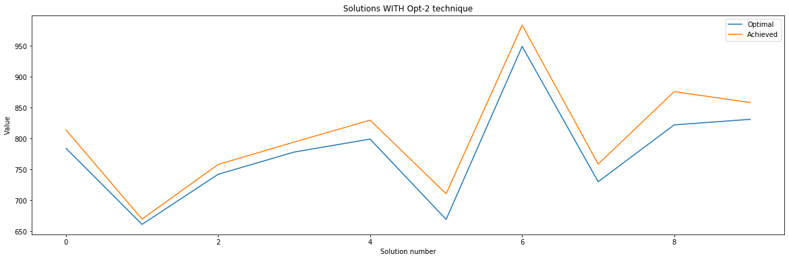

# Vehicle Routing Problem using ACO

> Solving the Capacitated vehicle routing problem using Ant Colony Optimisation techinique.


## Table of contents
- [Vehicle Routing Problem using ACO](#vehicle-routing-problem-using-aco)
  - [Table of contents](#table-of-contents)
  - [Motivation](#motivation)
  - [Graph of a typical dataset](#graph-of-a-typical-dataset)
  - [Technologies & Libraries](#technologies--libraries)
  - [Setup](#setup)
  - [Features](#features)
  - [References](#references)
  - [Contact](#contact)

## Motivation
> ACO is a very interesting algorithm derived from real life observations. It can be used to solve a plethora of real life porblems, especially in the domain of Operations Research.

## Graph of a typical dataset


## Technologies & Libraries
* Python 3.8.5
* Numpy 1.19.4
* Jupyter Notebooks
* Matplotlib

## Setup
Use latest version of pip to install dependancies
```bash
$ pip install -r requirements.txt
```
Then, run following commands to run the project
```bash
$ cd src/
$ python ./main.py
```

## Features
Comparisons to the optimal solution is visualised in Comparsion.ipynb


`Without using 2-opt technique`


`With using 2-opt technique`


A closer fit is achieved using 2-opt

## References
A lot of this work is inspired by [@Lolik-Bolik](https://github.com/Lolik-Bolik/)'s work.

Link to his work: https://github.com/Lolik-Bolik/Vehicle-Routing-Problem

## Contact
Created by [@andipro123](https://github.com/andipro123/) - feel free to contact me!